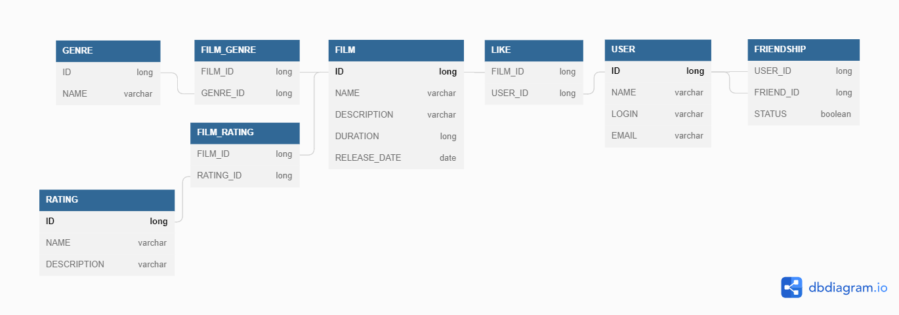

# java-filmorate
Template repository for Filmorate project.

Некоторые примеры SQL запросов:

Получение всех фильмов:

SELECT * FROM film;

Получение фильма по id:

SELECT * FROM film WHERE id=?;

Получение всех пользователей:

SELECT * FROM user;

Получение пользователя по id:

SELECT * FROM user WHERE id = ?;

Получение списка всех жанров:

SELECT * FROM genres;
